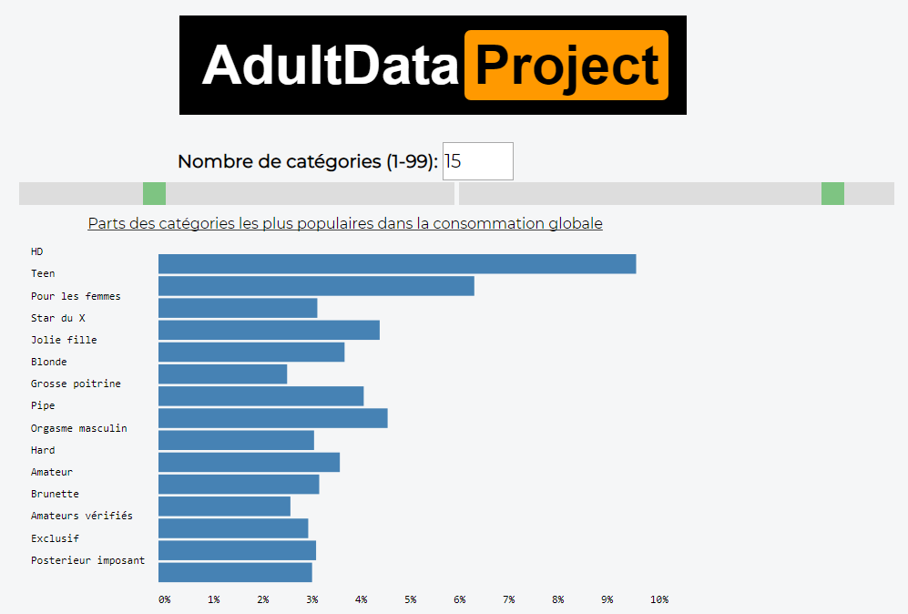

[logo]: 7-thumbnail.png "Titre"

# AdultDataProject

## Description

**What ?**
This project demonstrate the consumption of videos on the website *PornHub* during the month of december.  

**Why ?**
Adult videos represent more than 30% of the internet trafic and this induces a huge cost in storage and transfer. In 2019, Pornhub received 115 million visits per day, which corresponds to 18,000 terabytes of data transferred per day. Or 6,597 Petabytes this year, which consumes a lot of energy.
It is important to give the sites but also the authors clues regarding the relevance of the videos in order to reduce its energy cost.

**Who is it for ?**
This visualization is mainly intended for people who want to uplaode videos but also for distributors. They are also suitable for the general public in order to have a view of the trends of the site. Knowing that about 10% of videos are deleted afterwards, you might as well think ahead and avoid consuming unnecessary resources.

## Contributor

Arnaud Bressot (11505990), Valentin Canete (11502374),Adrien Guédet (11516525), Mouhamed Loum(11514727).

This site was create in the [course of data-viz](https://lyondataviz.github.io/teaching/lyon1-m2/2019/projets.html) by [Aurélien Tabard](https://github.com/aurelient). 

